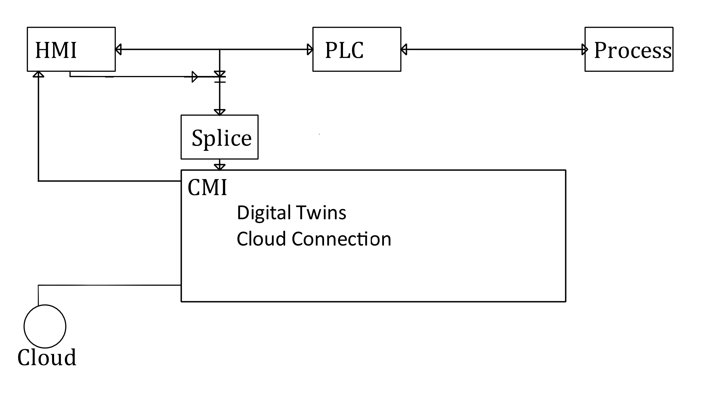

# Cloud Machine Interface
The Cloud Machine Interface (CMI) formed a starting point for this research. The goal of the CMI is to be a trusted, secure platform for retrofitting Industry 4.0.

### Jargon

#### PLC

The Programmable Logic Controller (PLC) is a realtime system that monitors connected sensors and actuators and makes control decisions based on its programming.

These devices may be distant from the operators that run the site.

Updates to these devices are done via an engineering workstation. Commonly, PLCs are programmed with ladder logic.

#### HMI

The Human-Machine Interface (HMI) is the primary way that operators can control the site. Additionally, alarms and warnings are visible on the HMI.

HMIs can read values and set target on the PLC but not update the logic.

#### Process

The process is the physical system under control. For our project, this is a boiler.

#### Splice

The splice is abstraction of a T-Junction with a one-way connection to the CMI. This simply prevents the CMI from being to interrupt to datastream between the HMI and the PLC. 

By preventing this connection at a physical level or electronic level, we can build trust in the system to not interfere with the plant.

---

## Diagram

Below is a diagram of the Cloud Machine Interface.

In this diagram, the CMI connects to the site via a splice between an HMI and a PLC. This provides us with any and all data that the HMI can see.

---

## Twin Interface

One of the requirements, from an engineering perspective, is a common, abstract interface that describes a twin.
This interface needs to provide a way to retrieve values from the twin alongside some representation of what the value means.

In PLC land, there are tags that represent what the value is, so providing a name in the interface should be permissable.

---

## Digital Twinning

A digital twin is a form of high-fidelity simulation that uses sensor data from a physical twin to inform its state.

One of the key benefits of a digital twin is being able to evaluate the result of a scenario without risking the physical twin.

### System Identification

Python forms the base of this project up to this point, and Python 3.6+ should be installed on your computer.

We use system identification to construct a digital twin based on historical data from a "physical" twin. At present, this twin is a simulation.

The two libraries used are `control`, which contains a large array of control, and `modred`. The latter is required at present due to `control` not implementing eigensystem realisation (`control.era`) yet. 

Testing System Identification is done by feeding a consistant disturbances into a physical and digital twin and measuring divergence over time.

### Disturbance Forecasting

Disturbances -- system inputs that are not in the internal state -- are not included in the identified system and therefore must be predicted by other means.

---

## Examples and Helpful Tips

### Files

#### SupportingEndpoints

Whilst not named properly, a considerable amount of the code is housed here. Largely, this folder contains experiments.

##### SupportingEndpoints/ProcessSimulation

This folder contains the simulator that is used by most experiments in the parent folder.

##### Graphing.py

Graphing handles the graphed simulator tests. For every time step, it takes a slice of past data (*t-15:t*) and uses the supplied method to predict values until reaching the current time *t*. When *t* is reached, the test predicts a further 15 future values.

This produces two metrics: an error from the current simulation step, and an prediction gradient.

---

## Project Resources

* [Steve Brunton's Youtube](https://www.youtube.com/channel/UCm5mt-A4w61lknZ9lCsZtBw)
* [Tensorflow - Not really necessary](https://www.tensorflow.org/)
* [Digital Twin: Mitigating Unpredictable, Undesirable Emergent Behavior in Complex Systems](https://doi.org/10.1007/978-3-319-38756-7_4)
* [The Digital Twin Paradigm](https://arc.aiaa.org/doi/10.2514/6.2012-1818)
* [Towards Security-Aware Virtual Environments for Digital Twins](http://doi.acm.org/10.1145/3198458.3198464)
* [Characterising the Digital Twin: A systematic literature review](https://doi.org/10.1016/j.cirpj.2020.02.002)
* [A digital twin based industrial automation and control system security architecture](https://doi.org/10.1109/TII.2019.2938885)
* [Enhancing Cyber Situational Awareness for Cyber-Physical Systems through Digital Twins](https://doi.org/10.1109/ETFA.2019.8869197)
* [The digital twin of an industrial production line within the industry 4.0 concept](https://doi.org/10.1109/PC.2017.7976223)
* [C2PS: A digital twin architecture reference model for the cloud-based cyber-physical systems](https://doi.org/10.1109/ACCESS.2017.2657006)
* [Digital twin-driven product design, manufacturing and service with big data](https://doi.org/10.1007/s00170-017-0233-1)
* [Experimentable digital twins for model-based systems engineering and simulation-based development](https://doi.org/10.1109/SYSCON.2017.7934796)
* [Data-centric middleware based digital twin platform for dependable cyber-physical systems](https://doi.org/10.1109/ICUFN.2017.7993933)
* [Leveraging Digital Twin Technology in Model-Based Systems Engineering](https://doi.org/10.3390/systems7010007)
* [Deriving a cost-effective digital twin of an ICS to facilitate security evaluation](https://doi.org/10.1007/978-3-319-99073-6_26)
* [A specification-based state replication approach for digital twins](https://doi.org/10.1145/3264888.3264892)
* [CyberFactory#1 - Securing the industry 4.0 with cyber-ranges and digital twins](https://doi.org/10.1109/WFCS.2018.8402377)